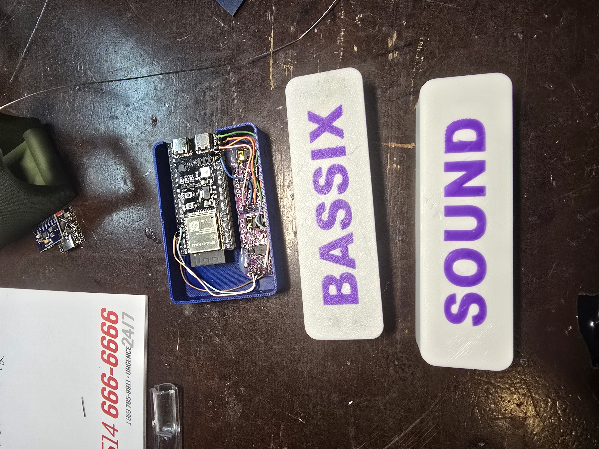

# CAD Cases

> **Lineage:** part of a build based on [FelipeAlme/DVS-Wireless-DIY-DJ-System](https://github.com/FelipeAlme/DVS-Wireless-DIY-DJ-System)
> by Felipe Alme, who started this project.

3D-printed enclosures for the receiver and the transmitter puck.

Fair warning: these designs are **rudimentary** — I'm not very experienced
in CAD — but they print fine and they've been working fine for me. Use,
remix, or redraw them entirely; the `.f3d` Fusion 360 sources are included
alongside the print-ready `.3mf` files. 

## Files

| File | What it is |
|---|---|
| `receiver.f3d` / `Receiver-case.3mf` / `receiver-lid.3mf` | Receiver box (ESP32-S3 + two PCM5102A DACs) and its lid |
| `transmitter.f3d` / `transmitter-case.3mf` / `transmitter-lid.3mf` | Platter puck (ESP32-C3 + MPU6050 + battery) and its lid |
| `pack-box.f3d` / `pack-box.3mf` / `pack-box-lid.3mf` | Carry/storage box and lid |

## Assembly notes

- Almost everything is held in place with **hot glue** — boards, wiring. Low-tech, but it damps rattles and survives platter duty. The receiver status LED hole I also filled with hot glue, works fine for me. 
- You will need battery springs for the integrated battery holder, you can get these on amazon/AliExpress, they're 12mmx12mm battery contacts. 
- The one exception is the **gyro (MPU6050), mounted with M2 self-tapping
  plastic screws**. That one shouldn't be glued: it's the sensor doing the
  measuring, so it wants a rigid, flat, non-creeping mount to the case.
- The puck runs on a CR123a shaped li-ion rechargeable battery with onboard USB-C port, take it out for recharging, put a spare one in. You can find these on AliExpress. 

## Photos

Receiver internals (ESP32-S3 dev board + the two DAC boards, dual USB-C at
the top edge) next to the printed lids:

Closed receiver (A/B deck outputs labeled, status LED lit) and the open
transmitter puck — battery bay up top, MPU6050 on its screws in the middle,
ESP32-C3 below:

