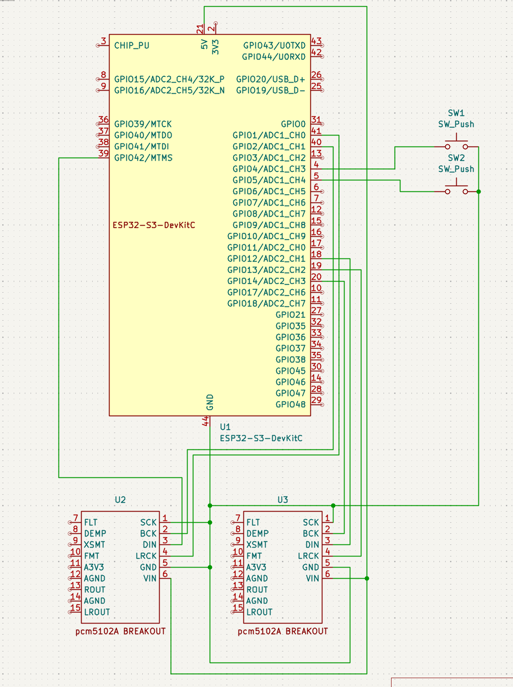
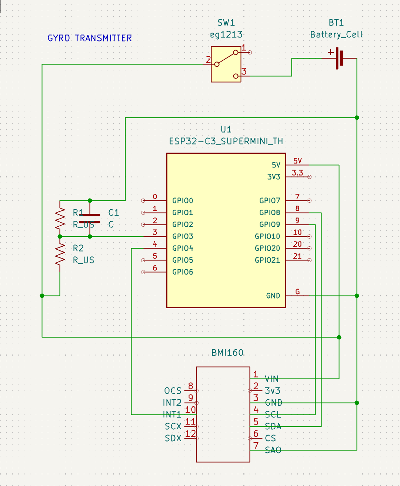

# DIY DVS cases, schematics, and BOM

This folder contains the printable enclosure files and a hardware bill of
materials for a complete two-deck system:

- two wireless transmitter pucks (TX);
- one dual-deck receiver (RX); and
- one optional storage case.

The matching manufacturing archives are
[`../PCB/TX-gerber.rar`](../PCB/TX-gerber.rar) and
[`../PCB/RX-Gerber.rar`](../PCB/RX-Gerber.rar).

## Printable files

| File | Quantity to print | Purpose |
|---|---:|---|
| `TX-Bottom.stl` | 2 | Transmitter puck base |
| `TX-Top.stl` | 2 | Transmitter puck lid |
| `RX-bottom.stl` | 1 | Receiver base |
| `RX-top.3mf` | 1 | Receiver lid |
| `RX-button.stl` | 2 | Receiver button cap |
| `storage-bottom.stl` | 1 optional | Storage/carry case base |
| `storage-top.stl` | 1 optional | Storage/carry case lid |

Check the slicer preview before printing. The CAD files do not prescribe a
specific material, layer height, wall count, or support strategy, so choose
settings appropriate to your printer and expected use.

## Complete BOM: two TX and one RX

### PCB and electronic assemblies

| Quantity | Component | Used by | Notes |
|---:|---|---|---|
| 2 | TX PCB | TX | Order from `TX-gerber.rar` |
| 1 | RX PCB | RX | Order from `RX-Gerber.rar` |
| 2 | ESP32-C3 SuperMini, through-hole module | TX | One per puck; flash the BMI160/BMI120 TX firmware |
| 2 | GY-BMI160 breakout module | TX | A compatible BMI120 may work with the same firmware |
| 2 | EG1213 slide switch | TX | PCB footprint `EG1213` |
| 4 | 100 kOhm resistor, 1%, 0603 | TX | R1 and R2 on each TX PCB |
| 2 | 100 nF ceramic capacitor, 0603 | TX | C1 on each TX PCB |
| 2 | Protected rechargeable 16340 Li-ion cell | TX | CR123A size; the case is intended for a removable cell |
| 2 sets | 12 mm x 12 mm battery contacts | TX | One positive/negative contact set per puck |
| 1 | ESP32-S3-DevKitC-1 N16R8 | RX | Current firmware uses the onboard WS2812 on GPIO 48 |
| 2 | PCM5102A stereo I2S DAC breakout | RX | One DAC per deck; use modules matching the PCB footprint |
| 2 | 6 mm through-hole momentary pushbutton, 5 mm high | RX | PCB footprint `SW_PUSH_6mm_H5mm` |

### Mechanical and wiring items

| Quantity | Item | Notes |
|---:|---|---|
| 2 sets | Printed TX base and lid | One set per turntable |
| 1 set | Printed RX base and lid | Receiver enclosure |
| 2 | Printed RX button cap | One per receiver button |
| As needed | M2 x 4 mm self-tapping screws | Secure the TX PCBs in the transmitter cases |
| As needed | M3 x 4 mm self-tapping screws | Secure the RX PCB in the receiver case |
| 2 | 20 x 20 mm self-adhesive pads | Fit one underneath each transmitter |
| As needed | 26-30 AWG insulated hookup wire | Use multiple colors for power, ground, and signals |
| As needed | Heat-shrink tubing | Insulate exposed wiring and provide strain relief |
| As needed | Hot glue or electronics-safe adhesive | Secure wiring without covering USB ports or buttons |

### Cables and external equipment

| Quantity | Item | Notes |
|---:|---|---|
| 1 | USB-C data cable | Receiver-to-Windows USB connection and power |
| 2 | Stereo audio cables or adapters | One deck per PCM5102A output |
| 1 | Audio interface | Must provide suitable line-level inputs for both decks |
| 2 | Turntables | One transmitter puck per platter |
| 1 | Windows PC | Runs the DJ software and optional DVS Manager |

Buy at least one spare ESP32-C3, BMI160, and PCM5102A module. Small passives
are normally sold in strips or kits, so ordering extras is inexpensive.

## TX population values

The current KiCad schematic displays generic `R_US` and `C` labels. Populate
the PCB using these firmware-required values:

```text
Switched BAT+ ---- R1 100k ----+---- GPIO 3
                               |
                             C1 100 nF
                               |
GPIO 3 ---------- R2 100k ----+---- GND
```

The two 100 kOhm resistors form a 2:1 battery-voltage divider. C1 filters the
ADC input. The divider must be connected to switched battery power so it does
not continuously drain the cell while the puck is off.

The BMI160 connections used by the current firmware are:

| BMI160 signal | ESP32-C3 pin |
|---|---|
| SDA | GPIO 8 |
| SCL | GPIO 9 |
| INT1 | GPIO 4 |
| CS | 3.3 V |
| SA0 | GND |

Flash each transmitter with the BMI160/BMI120 firmware. Power on a puck only
while its platter is stationary so boot-time gyro zeroing can complete
correctly.

## RX connections

| Signal | Deck A DAC | Deck B DAC |
|---|---:|---:|
| BCK | GPIO 2 | GPIO 14 |
| LRCK / WS | GPIO 1 | GPIO 13 |
| DATA / DIN | GPIO 42 | GPIO 12 |

The receiver buttons connect GPIO 4 and GPIO 5 to ground. The firmware enables
the ESP32-S3 internal pull-ups.

## Schematics

### Receiver



### Transmitter



## Safety and first-power checks

- Verify battery polarity and check for a short between power and ground
  before inserting a cell.
- Use protected Li-ion cells and a charger intended for the exact cell type.
  Do not charge an improvised or damaged battery assembly.
- Test each transmitter and the receiver on the bench before installing them
  in their cases.
- PCM5102A output is line level and can be much hotter than a phono cartridge.
  Connect it to line inputs or suitable attenuation, not directly to an
  unattenuated phono preamp.
- Verify both deck directions, stopped-platter stability, battery readings,
  calibration, and both DAC outputs before performance use.
